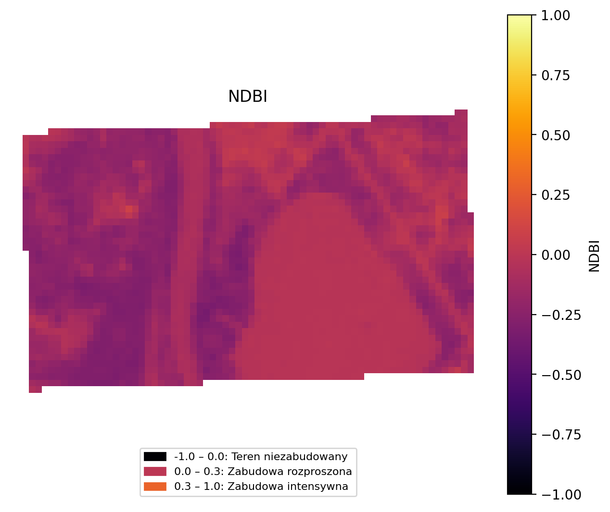
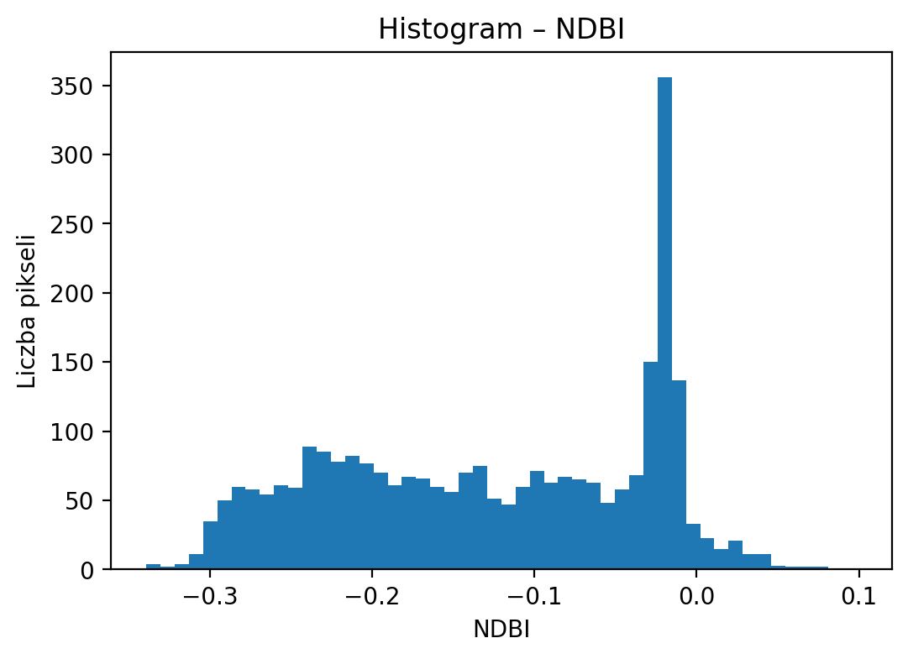
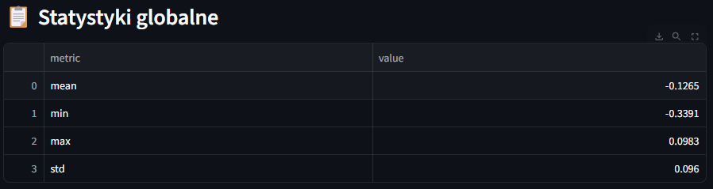

# 🛰️ Sentinel-2 Spectral Indices Explorer (Streamlit + GeoPandas)

Interaktywna aplikacja webowa do analizy **indeksów spektralnych Sentinel-2**
(NDVI, NDWI, NDBI) dla dowolnie wybranego obszaru (AOI) z wykorzystaniem:

- **Streamlit** – szybki interfejs webowy
- **GeoPandas** – obsługa danych wektorowych
- **Rasterio** – przetwarzanie danych rastrowych
- **STAC API (Planetary Computer)** – pobieranie danych Sentinel-2
- **Docker** – pełna konteneryzacja aplikacji

---

## ✨ Funkcjonalności

✔️ interaktywna mapa (rysowanie AOI – poligony)  
✔️ ograniczenie maksymalnej powierzchni AOI (100 km²)  
✔️ wybór indeksu spektralnego (NDVI, NDWI, NDBI)  
✔️ wybór zakresu dat (kalendarz)  
✔️ filtr zachmurzenia Sentinel-2  
✔️ dynamiczne pobieranie danych Sentinel-2 L2A  
✔️ obliczanie indeksów spektralnych  
✔️ mapa rastra + histogram wartości  
✔️ statystyki globalne (mean, min, max, std)  
✔️ eksport wyników do CSV  
✔️ cache zapytań STAC  
✔️ pełna obsługa CRS i resamplingu pasm  
✔️ uruchamianie w Dockerze

---

## 🧠 Obliczane indeksy

| Indeks | Wzór | Interpretacja |
|------|------|--------------|
| **NDVI** | (B08 − B04) / (B08 + B04) | Kondycja roślinności |
| **NDWI** | (B03 − B08) / (B03 + B08) | Wilgotność / woda |
| **NDBI** | (B11 − B08) / (B11 + B08) | Zabudowa |

---

## 🗺️ Interfejs aplikacji

### 1️⃣ Wybór AOI (Area of Interest)
Użytkownik rysuje jeden lub więcej poligonów bezpośrednio na mapie.

> Maksymalna powierzchnia pojedynczego poligonu: **100 km²**

---

### 2️⃣ Wybór parametrów analizy

- indeks spektralny
- zakres dat
- maksymalne zachmurzenie

---

### 3️⃣ Mapa indeksu spektralnego

Raster indeksu wyświetlany jest z odpowiednią paletą barw oraz legendą.

---

### 4️⃣ Histogram i statystyki

- histogram wartości indeksu
- statystyki globalne
- eksport do CSV

---

## 🏗️ Struktura repozytorium

